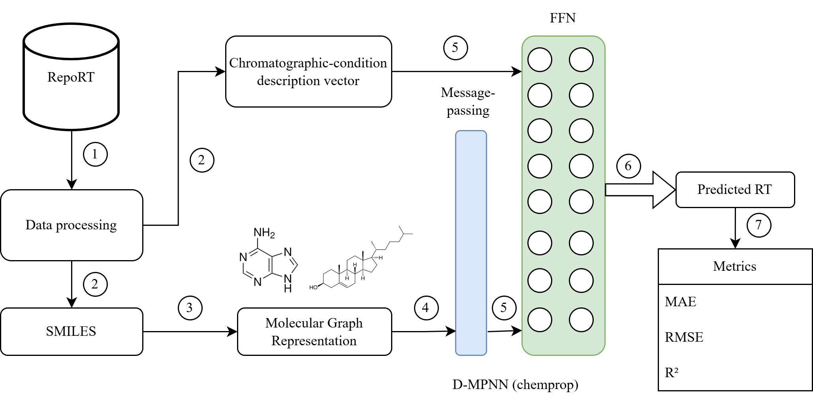

# TFG_Yixi

## 0. Backgrounds
This project has been developed for the Bachelor's Thesis in degree of Biotechnology, ETSIAAB, UPM.

It can be interpreted as a small API for training D-MPNN (Directed-Message Passing Neural Network)-based model for retention time (RT) prediction of small molecules (metabolites) for RP-LC (Reverse phase-Liquid Chromatography) setups using Chemprop (See the following image for an illustration).



The main data source is RepoRT, an online database containing experimental RT data from different chromatographic conditions.

The main difference between this project to most of the previous works is that, here, no extra RT data of the objective chromatographic condition is needed to apply transfer-learning nor any projection method.
Because chromatographic condition modelling has been incorporated to the model, thus it can make predictions on unseen chromatographic conditions without any extra standard metabolites from the objective chromatographic condition. 
Even though our results suggested that including some standards in the train set could potentially improve the results by a lot.
## 1. Raw data fetching

For raw data fetching, 2 methods can be applied:

1. Include RepoRT GitHub as a submodule of this repository.
2. Fetch data using URL.

The second approach was taken in this project, meaning that the first time the user builds the processed datafile, a fetching process will be required, which will last for 6-7 minutes. The result would be .tsv files containing raw data. This process will not be required once these raw .tsv files have been built.

Although if one prefers to take the first approach, he/she should only adapt `./src/RepoRT_data_processing/RepoRT_get_raw_data.py`, as the preprocessing Script only requires the .tsv files produced from that Script and not repeated the whole process.

## 2. Data preprocessing

Although strictly speaking, the objective of this file is the same as data processing, and in the thesis, `data preprocessing and filtering` was used to refer both preprocessing and processing Scripts here separated.

This division was made mainly for adding an extra control. Here, the referred script is `src/RepoRT_data_processing/RepoRT_preprocessing.py`. In concrete, in this step, those processing parts that do not require dropping any RT data is contained here, with the exception of the NPLS (Natural Product-Likeness Score) filter for SMRT, which was much more convenient including it in this Script. Namely:

1. Filtering SMRT by NPLS threshold of -0.6
2. Change RT from minutes to seconds.
3. Updated some formulas as some of them were incorrect. 
4. Unified all units. mM and uM -> %(m/v). Thus removed all columns containing ".units".
5. Imputed some missing values in metadata with global mean.
6. Filled with 0 all the NA value rested.
7. One Hot Encoded USP code.
8. Changed the gradient data starting time from minutes to seconds.
9. Updated the missing flow rate values in gradient data with the imputed value.

After this, preprocessed datatables are produced, which is the input for the later processing.

## 3. Data processing. 

This Script (`src/RepoRT_data_preocessing/RepoRT_processing.py`) contains all the processes that will drop RT data, except fot filtering SMRT by NPLS threshold. In concrete:

1. Merges the repositories that shared the same chromatographic condition into a single one and give a new unique-ID: cc-ID.
2. Eliminates some not relevant column for training models.
3. Computes the max and mean RT for each cc-ID
4. Treat doublets with 2.5% of max RT of a cc-ID.
5. Eliminates non-retained entries. The algorithm is coded in `void_time_detection.py` in the same directory.
6. Filters cc-ID that has <20 molecules.
7. Eliminates cc-ID that uses >2 eluents and all related columns.
8. Eliminates all the cc-ID that has >12 segments in their gradient.
9. The final modelling of gradient data only contains B[%], as its relation with A[%] is simple: 100% - A[%], thus it should be redundant for the model.

A deprecated mechanism in the thesis (not evaluated, but it can be as the code has not been removed) is the down filter for gradient data. If set to True, those cc-ID with <3 segments will be dropped as well.
But, this case has not been evaluated.

For all these steps, sanity check files are produced indicating how many entries or columns were dropped.

Finally, the possibility of dropping NPLS-filtered SMRT option is also provided. If activated, the processed files will be saved in a separated directory.

These processed datatables will be the input for different splitting strategies and training D-MPNN models.

## 4. Training D-MPNN models

All the Scripts are located in `src/training/`, it should be noted that the Scripts used for obtaining the results presented in the thesis are:

* `src/training/RepoRT_kfold/*/main.py` -> random, cc and scaffold split and random-split baseline.
* `src/training/RepoRT/model_per_repo_scaffold/main.py` -> Bemis-Murcko scaffold split baseline.

Users can directly run these files without having done anything beforehand, as if the datasets were missing, they would be built automatically. But as mentioned before, if it is the first time running any Script, the data fetching process will taka a while.

In all these Scripts, options are provided: whether to use extra molecular descriptors and if including NPLS-filtered SMRT.

Those Scripts that were not used for obtaining results that are included in the final thesis has the param_dict filled with the default values of Chemprop. And those Scripts used for this thesis, their param_dict contains the hyperparameters' value of this project.

For all cases, if none of the parameters have been modified, the default setting is this:

- Not using NPLS-filtered SMRT.
- Not using molecular descriptors (Monoisotopic mass and logP).
- Not appltying down filter for gradient data.

As these Scripts can not accept CLI arguments, one problem will be that using a single directory will not be enough to run many models for the same splitting in the way that one uses molecular descriptors and the other does not. So, a proposed way to do this is to duplicate the directory and change "using_moldescs" Boolean to True. Same would apply for using SMRT or not. And this can be automatized using Bash Scripts.

Finally, all the k-fold Scripts but the random-split baseline take approximately 16h to run, while the 10-fold baseline would take 30h. A single-fold baseline takes 3h to finish.


## 5. Future prospects

Many improvements could have been done, but due to the time limitation, we needed to finish this project at this point for the thesis. But mainly the improvements should be done in the D-MPNN model per se, as this might not be expressive enough for this task. So, models like Graph Convolutional Network (GNN + ResNet architechture) or
Graphormer, in which attention mechanism has been applied yielding a much more powerful aggragation mechanism.

Moreover, there are some minor changes that could be done to the chromatographic condition modelling, for example, the imputation algorithm (k-means imputation, e.g.) or there are parameters like t0, that can be computed as a product of other parameters of the column or the column flow rate, that might be somehow redundant as it is included in the gradient data "per segment".

Another approach could be using molecular FingerPrints in combination with its graph representation, although it can be redundant and not improving the results whatsoever. 

Even more molecular descriptors can be used in addition to the monoisotopic mass and logP evaluated in this project. One of those could be the pKa value of the molecules, however, the problem is that there is no free software and not enough experimental data to cover all molecules used for training models. The usage of extra molecular descriptors has been proven to help the model to predict more accurately in all scenarios but the cc split scenario.

However, the last points should be considered after implementing a more expressive model, as it can be seen that the main variation comes from the unseen chromatographic conditions.

## 6. References

```angular2html
Esther Heid, Kevin P. Greenman, Yunsie Chung, Shih-Cheng Li, David E. Graff, Florence H. Vermeire, Haoyang Wu, William H. Green, and Charles J. McGill
Journal of Chemical Information and Modeling 2024 64 (1), 9-17
DOI: 10.1021/acs.jcim.3c01250 (chemprop)

Domingo-Almenara, X., Guijas, C., Billings, E. et al. 
The METLIN small molecule dataset for machine learning-based retention time prediction. Nat Commun 10, 5811 (2019). 
https://doi.org/10.1038/s41467-019-13680-7 (SMRT)

Kretschmer, F., Harrieder, EM., Hoffmann, M.A. et al. 
RepoRT: a comprehensive repository for small molecule retention times. Nat Methods 21, 153–155 (2024). 
https://doi.org/10.1038/s41592-023-02143-z (RepoRT)
```